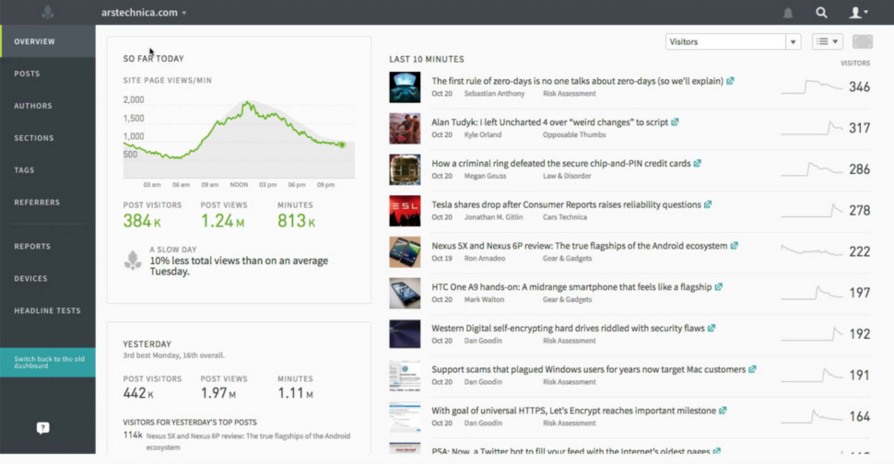

## Web Content Analytics at scale with parse.ly

Analyze web analytics to generate a time series engine.

## history

* 2013: Can solr be a time series engine
* 2014: can es aggregations do this?
* 2015: can es take 10k writes /s and store 10tb+? Yes. With caveats.

## Data tips

* Avoid fielddata. Use doc_values where possible.
* Don't use _source especially if your schema has high cardinality multi value fields

## Stored events

* Using rollups grants better latency than log style records.
* 1 day rollup: url, date, visitors (exclude from source due to high cardinality), metics (views, engaged seconds, etc), meta data (meta data of document: author, section, etc)
* 5 minute rollup: same structure as day, but with 5 minute span. For more granular or real time reporting
* raw event: formatted just like a rollup document. Single page view. Capture millions per day
* These each are in different document types, with different indexes.

## versions

* v1 was mongo + redis
* v2 was es. simpler design at data access to improve horizontal scaling

### historical analytics

* spark for historical data. Create thousands of nodes to pull historical data from v1 into v2.
* also smooths out missing data from daily outages

### product

* real time data sells product
* historical data answers questions

### slowness advice

* give big customers their own index
* hot / cold something or other

### all together now
* time based indices
* index versioning
* see photo

### node shard allocation
* raw (cpu), hot (mem cpu), warm (mem, ssd), cold (mem, rust)
* system spread across availability zones

### namespaces
* v1_shared: lots of small customers
* v1_condenast: big customer (new yorker, vogue)
