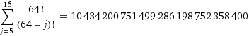

## Gamertag-Findernator: Finding words in a sea of non-words

Activision

Will Kirwin

[Slidedeck](https://speakerdeck.com/player/5844d8b8cc1e4f1688d5da6c730d67dc?#)


##Agenda
- Given an approximate gamertag, how do we find relevant, actual gamertags?
- How to (Ab)using ES analyzers for gamercase


## The problem

"How fun is smashing n00bs on Xbox live if you don't have a unique Gamertag for them to remember and fear?" -Wikihow

"I had one of my friends change their gamertag to match mine almost exactly. Only one letter was changed from mine" - A dude on the Internet


- 120k words in standard spellchecker
- 64 allowed characters for PS4 Gamertag
  - 5-16 characters long
- Unique gamertags:



- Gamertags are not actual words, l33t speak


## Sample gamertags with decorations
- c0wnt_z3r0
  - c0wnt_z3ro,  kowntZ3r0, the-count-zero, c0ount-zer0
- saturnboyz
- leafknode
- yellowspur
- c0wnt\_z3r0\_83
- xX the-count-zero Xx
- \_oO KowntZ3r0 Oo\_


## How to search?

count zero -> [c0unt-zero, kowntZ3ro, etc]


## Regular spellchecker

lowercase, strip white space, normalized form of every word.

" Electrontic " => "electrontic" => "Did you meant? electronic"


## Gamercase spellchecker

Lower case, with l33t speak, strip decorations

- count
- c0unt
- Kownt
- ...
- CoRnt


## Nearest neighbour

with some string edit distance

- (E, e, 3) => e
- (o, O, 0) => 0
- ...

Algorithms:
- Jaro
- Jaro-Winkler
- Levenshtein


## How do you use ES for gamercase?

By (ab)using ES analyzers


## Standard ES string analyzer
- Doc
- Character filter (strip HTML)
- Tokenizer (split into words)
- Filter (remove stop words, a, the, of, etc)
- ES


## Gamer camelcase analyzer
- Doc (tag)
- Character filter (strip decorators)
  - \#\#\#...\# => NNN
  - \#\# => YR
- Tokenizer
  - C4m3lC4s3 => C4m3l C4s3
- Filter
  - (E, e, 3) => e
  - (A, a, 4) => a
- ES


## Three Analyzers
- gamercase
  - digit/decorator preprocess
  - white space like tokenizer
  - gamercase
- gamer-camelcase
  - digit/decorator preprocess
  - camelcase-like tokenizer
  - gamercase
- raw
  - raw gamertags, exact hits are important


## Filter
```
"gc-0o": {
  "pattern": "0",
  "type": "pattern_replace",
  "replacement": "o"
}
```

## Tokenizer
```
"C4m3lC4s3": {
  "type": "pattern",
  "pattern": "...Regex..."
}
```


## Gamer camel case analyzer
```
"gamerCamelCase": {
  "type": "custom",
  "char_filter": ["html_strip"],
  "tokenizer": "C4m3lC4s3",
  "filter": ["lowercase", "gc-0o"]
}
```


## Mapping
Use several analyzers
```
"gamertag": {
  "type": "string",
  "fields": {
    "raw": {
      "type": "string", "index": "not_analyzed"
    },
    "gamercase":{
      "type": "string", "analyzer": "gamercase"
    },
    "gamercamel":{
      "type": "string", "analyzer": "gamerCamelCase"
    }
  }
}
```


## Query template
```
{"query": {"bool": { "should": [
      {"fuzzy_like_this_field": {
          "gamertag.gamercase": {
            "like_text": "{{gamertag}}",
            "analyzer": "gamercase", "boost": 2
            //...}}},
      {"fuzzy_like_this_field": {
          "gamertag.gamercamel": {
            "like_text": "{{gamertag}}",
            "analyzer": "gamerCamelCase", "boost": 2
            //...}}},
      {"match": {
          "gamertag.raw": {
            "query": "{{gamertag}}",
            "boost": 10
          }}}]}}}
```