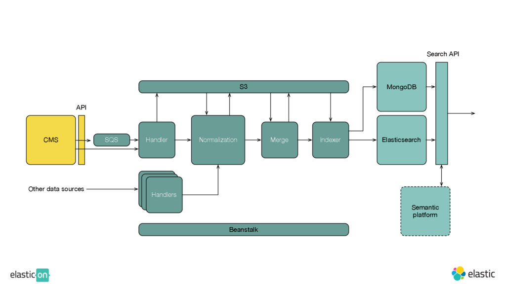
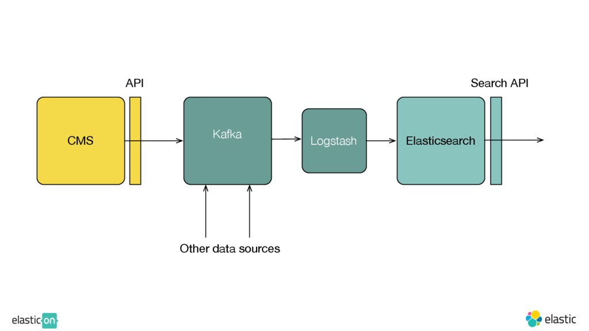

## All the data that’s fit to find: Search @ The New York Times

New York Times

Boerge Svigen

[Slidedeck](https://speakerdeck.com/player/b4eb957915a84b678b9c4f021b651e1b?#)

## Agenda
How to do search at NYT and what they've learned

Take aways:
- Keep it simple, things gets complicated, need to think things through
- Why not just use Google?  ¯\\\_(ツ)\_/¯
- Is ES the right tool for text search?

## NYT
Has been publishing news since 1851, 165 years
- Website has been 20 years old
- Well over 1 million paying subscribers
- Been indexing content since 1913 with inverted index, first done manually
- First search engine offered in 1969, in house development, provided as a service to customers.

## How NYT use search
- Everything is searchable since 1851
- Explicit searches: Searches done by end users, websites, apps, APIs, internal tools, where there is a search box
- Implicit searches: Searches from software. Website homepage, app default articles, etc

## Ingestion pipeline
- Low rate, 1000 updates a day
- Sources
  - CMS
  - Legacy systems
  - File based archives
- Low latency, <1s

## How people use search
- Find something you read (on paper), date is very important, since web and paper publication date can be different
- Ego search, find something you wrote
- Searching for reviews
- Recipes, launched a cooking app, and became really popular, (more than 100 years of recipes)
- Manual sharing, hey, I read something about some subject, and others go search for the subject
- Casual news search, what happened recently
- Serious news search, journalist, historians, etc

## Why not just use Google?
- Want to keep customer on the site
- There is no Google for native apps, native apps need to provide good search, and is important
- Knows the content better, editorial team, taxonomy team
  - ES offers abilities to tweak these settings
  - Google: Review of a movie
  - NYT/ES: Top 10 articles about the conflict in Syria

## Infrastructure
- Runs on AWS (web side)
- Runs two full production clusters
- DNS failover
  - Major changes, and reindexing
- 16 nodes ES clusters (m1.xlarge)

## Current ingestion pipeline
CMS (Content) -> SQS -> Handlers (Data sources) -> Normalization (Java normalization rules) -> Merge (Fetch all the latest document) -> Indexer -> ES (Canonical document)/Mongo (Full document) -> Search API

## Issues
- Too many moving parts, and things will go wrong
- Difficult to add new fields for ES, add new rules to normalization step, and reindex everything
- Don't know if the failover cluster is working, and the cache is cold, needs to warm up the cache
- Difficult to run this locally
- Complex setup, spent lots of time doing devops instead of searching

## Simplifying the ingestion/search pipeline
- Store and index full document in ES
- No external lookup necessary in the API, no MongoDB
- Demand driven API, client can specify a list of keys to return

## Replay
- Use kafka, all content go through it
- Kafka will persist all content, source of truth
- Easy to create new search clusters from Kafka replay
- Never upgrade ES clusters

## Keep all clusters busy
- Production traffic gets replayed to both active and hot standby cluster (Gor)
- Hot standby cache is always warm

## Virtualize
- Use Vagrant box for everything
- Make it easy to run full pipeline locally
- Provision vagrant boxes using same system as production servers

## Conclusions
- Figure out how you can be better than Google, if not just use Google
  - Who your users are
- Make sure search is integrated part of the product
  - Often search is an after thought, make a search, and then add search
  - Consistent across devices
  - Focus where you can make a difference for your end user

##Infrastructure is hard
  - How do you do deployments?
  - How to do new deployments?
  - How to upgrade?
  - How to reindex?
  - How to change index?
  - Put configuration in version control
  - Virtualize everything
  - Make sure everything can run locally
  - Immutable servers, don't upgrade, deploy new versions
  - Make deploying new stacks automatic

## Is ES the right tool?
- ES 2.0 new features:
  - 6: Search (5%)
  - 39: Analytics (33%)
  - 74: Other (62%)
- Wants:
  - Query logs, wants to know what the users are searching
  - Use Logstash/Kibana
  - Easier relevancy tuning
  - Improved linguistics (no built in language detection, etc)
