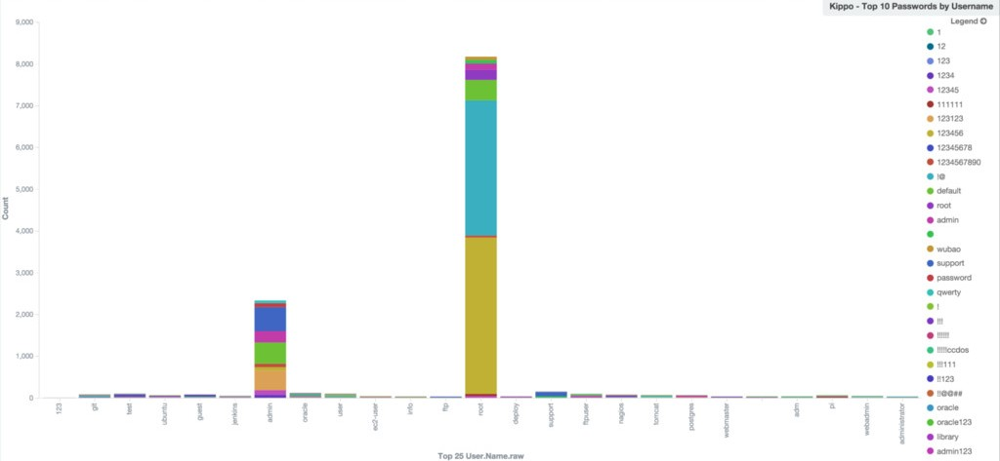
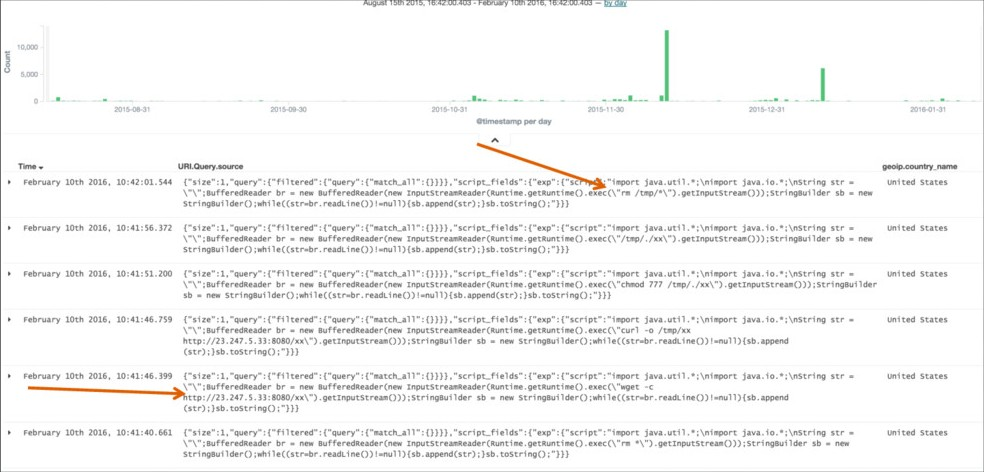
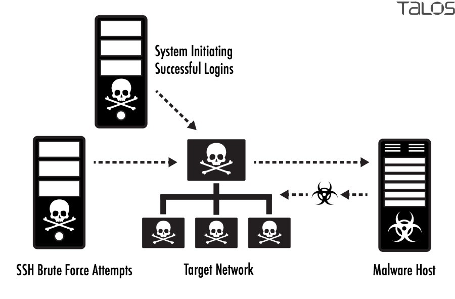
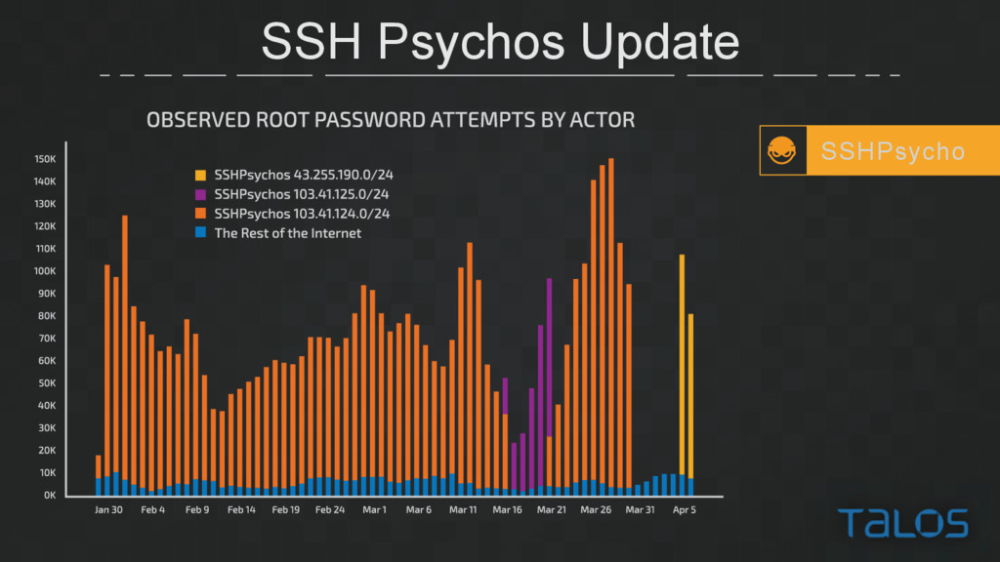
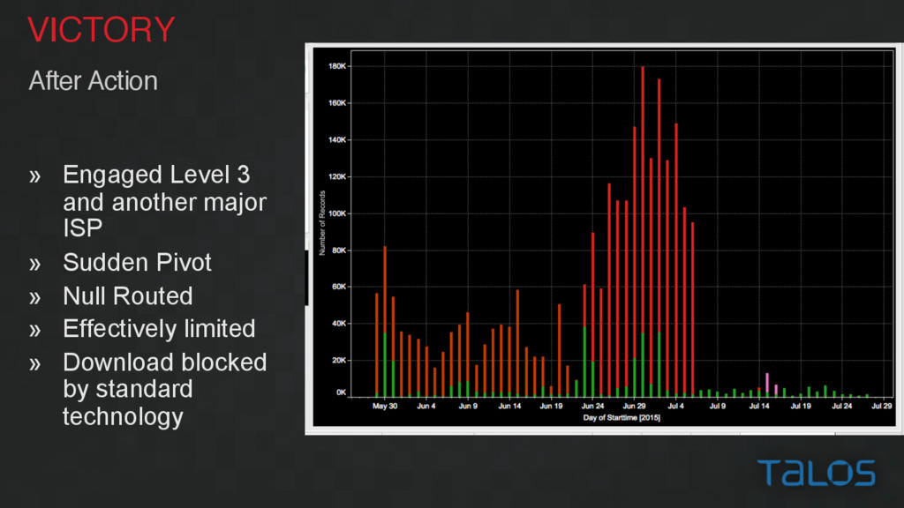

## Hunting the Hackers: How Talos is leveling up security

Cisco Talos Security Intelligence and Research Group

Kate Nolan

Samir Sapra

[Slidedeck](https://speakerdeck.com/player/8ca2848034414e3eaed64df15f14dac0?#)


## Agenda

- Threat landscape of the Internet
- How Talos use Elasticsearch
- How they took down an attacker that was causing 35% of all the SSH brute force attacks


## Threat landscape
- 1.5 million daily malware samples, of various files, PDF, document, flash, executables, etc.
- 500-600 Billions of emails daily, 86% is spam (425-510 billion)
- 20 billion threats blocked daily (7.2 trillion yearly, 3 blocks per person per world per day)
- 16 billion web requests per day
- 13 billion AMP (Advanced malware protection) request per day


## How Talos use Elasticsearch

Finding the needle in a very large haystack.

- Triaging new threats
- Actor attribution and **tracking**


## Why Elasticsearch
- Started using ES since 0.2
- Ease of setting it up and using it
- One day the boss was bored and need to "search for things through my things"
- Easy to write queries. Map Reduce vs JSON
- Quick, need immediate turn around time for writing detection, instead of writing complex Java programs, and processing data manually by hand


Configuration:
- 10 Nodes
- 3TB
- 100k reports/day
- ~8 months of data


## Data generated from
- Feeds (paid, customer, partner)
- Customer telemetry
- Self-generated intelligence
- Open source intelligence
- Twitter feeds
- Forum postings


## Types of data
- File samples
- Dynamic analysis*
- Network related data
- Intrusion detection system
- Intrusion prevention system
- Spam
- Hunting data/actor tracking


## Dynamic analysis/Sandbox
- Automated and user submitted runs
- Each run has a score. Score > x = bad file
- Reports tracks:
  - Process (registry, mutexes, IO)
  - Dropped files
  - IP Addresses
  - Domains
  - Indicators of Compromises


## Sandbox
- Domain generating algorithms. (Malware generating "random" hosts to connect for instructions)
- Malware family clustering.
- Connecting runs to a CIDR block
- Find new samples of malware based on mutex behaviour
- Detecting new Exploit kits by behaviour identified in Elasticsearch data


##Honeypots
Many different types of honeypot system deployed
- ssh
- Industrial systems
- Telnet
- Gas pumps
- Cisco Router
- Elasticsearch


```
{
  "query": {
    "bool": {
      "must": [
        {"match": {
          "ioc": "Benign windows process is dropping new PE files"}},
        {"match": {
          "processes.parent_name": "iexplorer.exe"}},
        {"match": {
          "processes.name": "iexplorer.exe"}},
      ],
      "should": [{"range": {"score": {"gte": 10, "lte": 99}}}]
    }
  }
}
```


Common passwords and usernames


root/123456
root/!@
root/1
admin/123123





# Taking down SSH Psychos attack with Elasticsearch





- Brute force SSH attack with 300k unique password dictionary
- Login from different system
- Connect to botnet
- Responsible for 1/3 of all SSH traffic on the Internet








## Why?
Online MMORPG